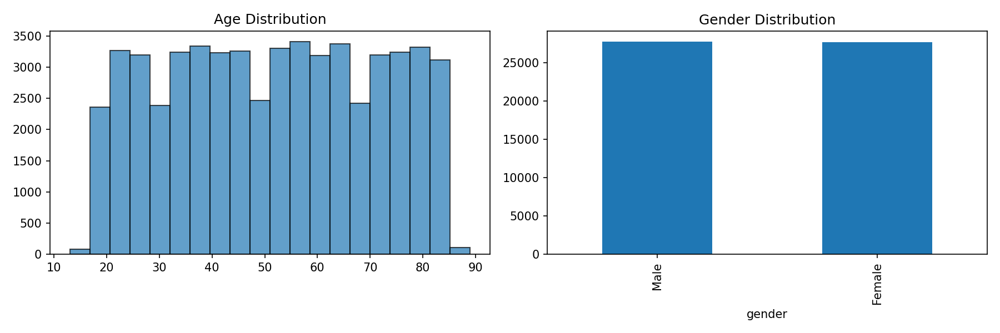
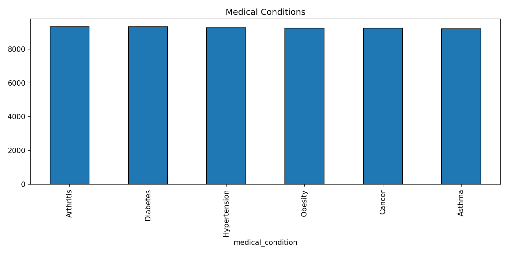
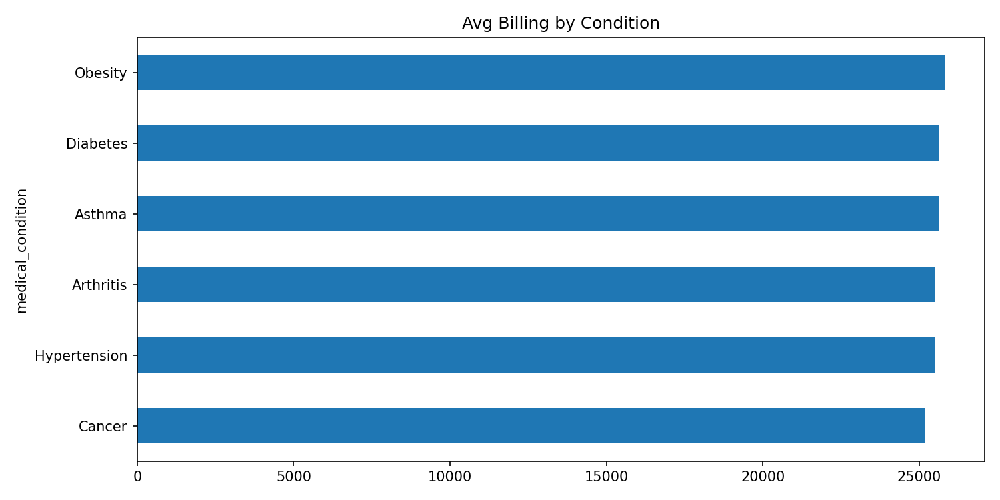
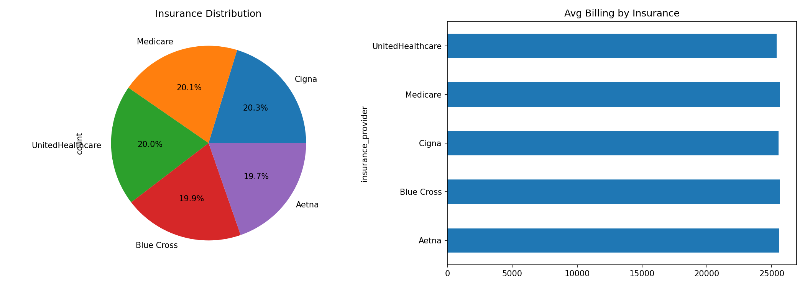
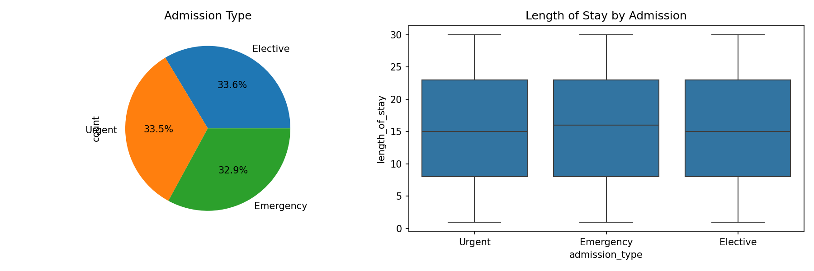
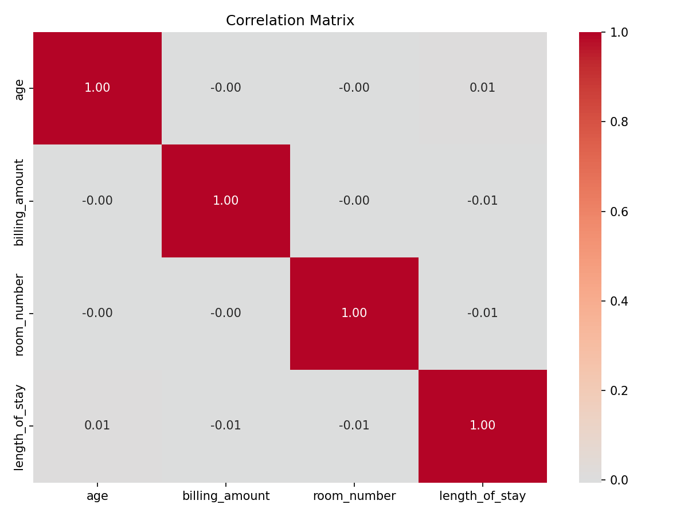

# Healthcare Analytics

Analyzing patient healthcare data to find patterns in admissions, billing, and treatment outcomes.

## About

I built this project to explore real-world healthcare data and practice my data analysis skills. The goal was to understand patient demographics, identify billing patterns, and find insights that could help healthcare providers make better decisions.

## Dataset

**Source:** [Kaggle - Healthcare Dataset](https://www.kaggle.com/datasets/prasad22/healthcare-dataset)

The dataset contains **55,500 patient records** from 2019-2024 with the following features:

| Feature | Description |
|---------|-------------|
| Name | Patient name |
| Age | Patient age (18-85) |
| Gender | Male/Female |
| Blood Type | A+, A-, B+, B-, AB+, AB-, O+, O- |
| Medical Condition | Cancer, Diabetes, Obesity, Asthma, Hypertension, Arthritis |
| Date of Admission | Hospital admission date |
| Doctor | Attending physician |
| Hospital | Healthcare facility name |
| Insurance Provider | Cigna, Medicare, Aetna, UnitedHealthcare, Blue Cross |
| Billing Amount | Total cost of treatment ($) |
| Room Number | Assigned room |
| Admission Type | Urgent, Emergency, Elective |
| Discharge Date | Hospital discharge date |
| Medication | Prescribed medication |
| Test Results | Normal, Abnormal, Inconclusive |

## Methodology

### What This Project Is

This is an **Exploratory Data Analysis (EDA)** project - not a predictive modeling project. I focused on understanding the data through visualization and statistics rather than building machine learning models.

### Why EDA Instead of ML?

| Approach | What It Does | Why I Chose/Didn't Choose |
|----------|--------------|---------------------------|
| **EDA** | Understand patterns, distributions, relationships | Chose this - best for understanding healthcare data before making decisions |
| Predictive Modeling | Train models to predict outcomes | Not suitable - dataset is synthetic with uniform distributions, predictions wouldn't be meaningful |

### What I Did

1. **Data Cleaning**
   - Standardized column names (lowercase, underscores)
   - Fixed inconsistent text formatting in patient names
   - Converted date strings to datetime objects

2. **Feature Engineering**
   - Created `length_of_stay` by calculating days between admission and discharge

3. **Exploratory Analysis**
   - Distribution analysis (age, gender, conditions)
   - Group comparisons (billing by condition, by insurance)
   - Correlation analysis between numeric variables

4. **Visualization**
   - Histograms and bar charts for distributions
   - Box plots for comparing groups
   - Heatmap for correlations
   - Pie charts for proportions

### What I Did NOT Do

- No machine learning models trained
- No predictions made
- No classification or regression

## Results

### Demographics

Age is uniformly distributed from 18-85 years. Gender split is roughly 50/50. This suggests the dataset is synthetic rather than real patient data.

### Medical Conditions

All six conditions have nearly equal patient counts (~9,200 each). In real healthcare data, we'd expect different prevalence rates.

### Billing Analysis

Average billing ranges from $25,400-$25,700 across all conditions. The similarity suggests billing isn't strongly tied to condition type in this dataset.

### Insurance Providers

Five insurance providers with roughly equal market share (~20% each). Average billing is similar across providers - no significant cost differences.

### Admission Type & Length of Stay

Three admission types: Emergency, Elective, and Urgent. Length of stay varies from 1-30 days with median around 15 days. Emergency cases show slightly higher variability.

### Correlation Matrix

Weak correlations between numeric variables. Age has minimal impact on billing amount or length of stay, which is interesting - older patients don't necessarily cost more.

## Key Findings

| Metric | Value |
|--------|-------|
| Total Patients | 55,500 |
| Date Range | May 2019 - May 2024 |
| Avg Billing | $25,539 |
| Avg Length of Stay | 15.5 days |
| Most Common Condition | All equally distributed |

### Observations

1. **Uniform distributions** suggest this is synthetic data - useful for practice but findings shouldn't be applied to real healthcare settings

2. **No strong predictors** - age, condition, and insurance don't significantly impact billing, which differs from real-world healthcare where these factors matter a lot

3. **Length of stay** is the most variable metric - could be worth investigating what drives longer stays

4. **Emergency admissions** show more variance in length of stay compared to elective procedures

## Limitations

- Dataset appears synthetic (too uniform)
- No patient outcomes tracked
- Missing cost breakdown (procedure vs medication vs room)
- No readmission data

## Future Work

- Add predictive modeling if real data available
- Analyze seasonal admission patterns
- Build interactive dashboard with Power BI

## Tools Used

- **pandas** - data manipulation
- **numpy** - numerical operations
- **matplotlib** - static visualizations
- **seaborn** - statistical plots
- **jupyter** - interactive analysis

